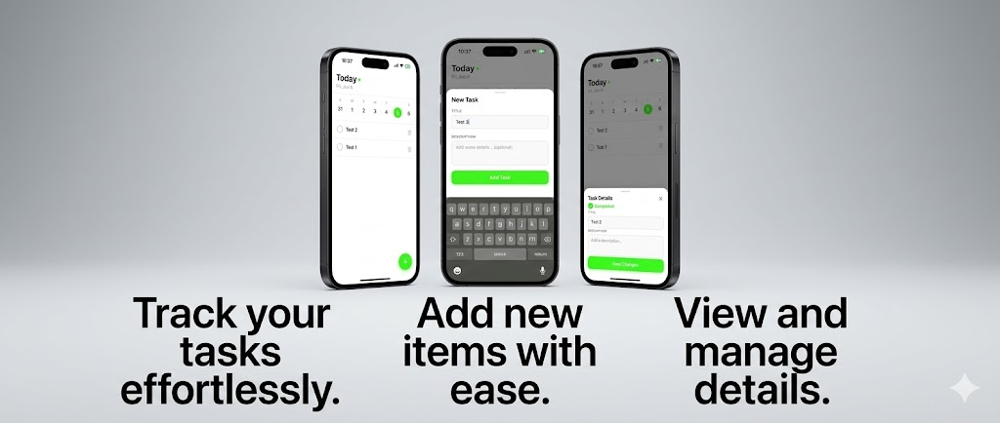

# takda-app

A React Native todo app with an Express + PostgreSQL backend.



## Stack

### Backend

- Express.js (Node.js + TypeScript)
- PostgreSQL
- Prisma ORM

### Mobile

- Expo (React Native)
- React Query + Zustand
- Axios

## Getting Started

```bash
# Backend
cd backend
npm install
npx prisma migrate dev
npm run dev
```

```bash
# Mobile
cd mobile
npm install
npx expo start
```

## Project Structure

```
takda-app/
├── backend/
│   ├── prisma/
│   │   ├── schema.prisma     # Database schema
│   │   └── migrations/       # Migration history
│   └── src/
│       ├── app.ts            # Express entry point
│       ├── lib/
│       │   └── prisma.ts     # Prisma client instance
│       └── routes/
│           └── todos.ts      # Todo CRUD routes
└── mobile/
    ├── app/                  # Expo Router screens
    ├── components/           # Reusable UI components
    ├── lib/                  # api.ts, queryClient.ts
    ├── store/                # Zustand stores
    └── types/                # TypeScript interfaces
```

## API Endpoints

| Method | Endpoint | Description |
| ------ | --------- | ----------- |
| GET | `/todos` | Get all todos |
| POST | `/todos` | Create a todo |
| GET | `/todos/:id` | Get a todo |
| PUT | `/todos/:id` | Update a todo |
| DELETE | `/todos/:id` | Delete a todo |
